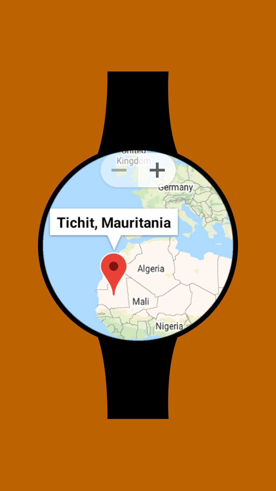
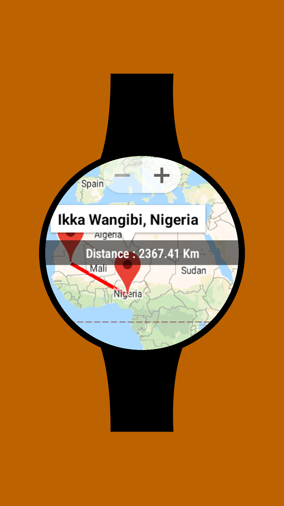
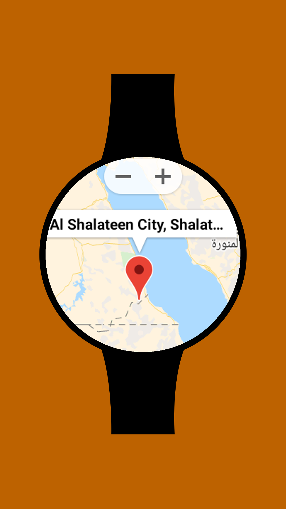
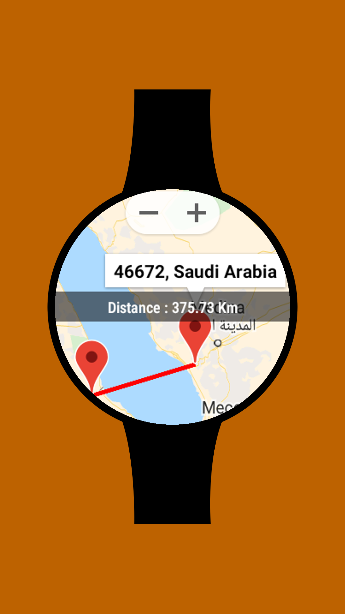
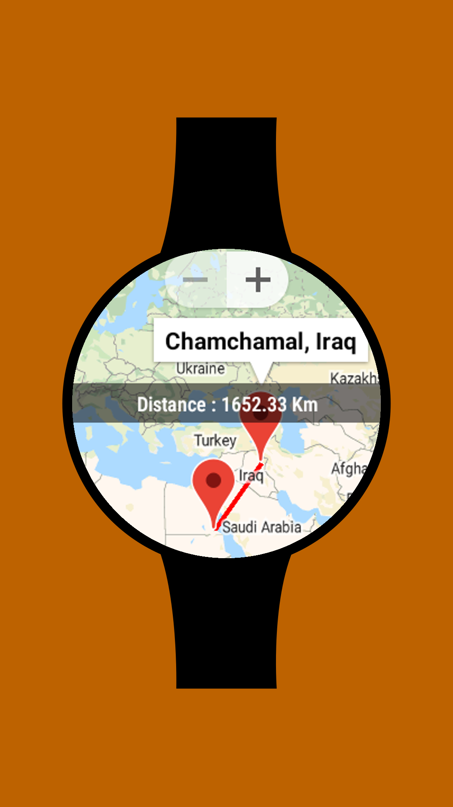
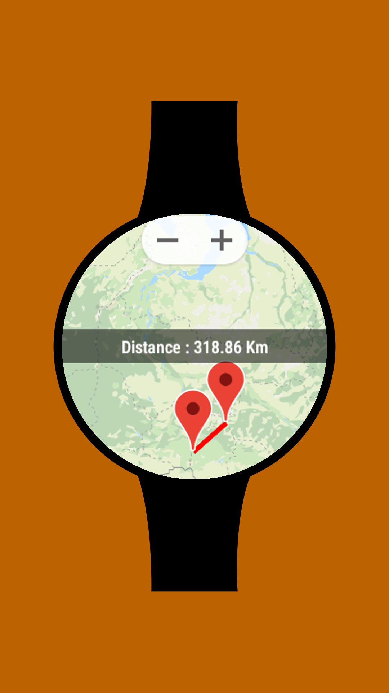

# Air Distance

<table>
    <tr>
        <th>Title</th>
        <td> Air Distance </td>
    </tr>
    <tr>
        <th>Short description</th>
        <td>Get Air Distance between 2 places</td>
    </tr>
    <tr>
        <th>Full description</th>
        <td> Air Distance   Choose 2 places, anywhere on the map, and get the air distance between those 2 places.   This is an open source application. You can view its source code on github [kashew-developers/AirDistance](https://github.com/kashew-developers/AirDistance)</td>
    </tr>
    <tr>
        <th>YouTube</th>
        <td>https://youtu.be/U6LjzgtFCFU</td>
    </tr>
</table>

----

#### Screenshots

<table>
    <tr>
        <td></td>
        <td></td>
        <td></td>
    </tr>
    <tr>
        <td></td>
        <td></td>
        <td></td>
    </tr>
</table>
